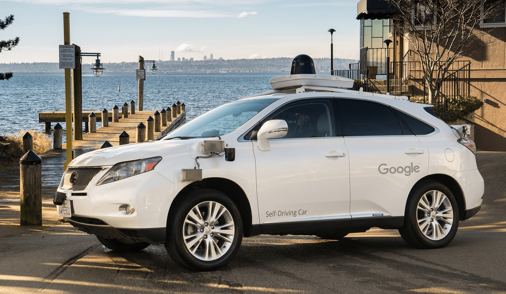

# 自动驾驶技术指南

--- A Guide to Autonomous Driving

本指南系统介绍自动驾驶技术的历史、现状与发展趋势，覆盖从基础概念到核心算法、从硬件系统到工程落地的完整知识体系。无论你是刚接触自动驾驶的学生，还是希望拓宽技术视野的工程师，都可以在这里找到适合的内容。

---

## 本指南包含什么？

| 章节 | 内容 | 适合读者 |
|------|------|----------|
| [第一章：概述](intro/main.md) | 自动驾驶的定义、SAE 分级体系、发展历史与术语表 | 所有读者 |
| [第二章：系统](system/main.md) | 车辆架构、V2X 车联网、高精地图、功能安全与法规 | 系统工程师、产品经理 |
| [第三章：硬件](hardware/main.md) | 计算平台、线控底盘、车载通信、传感器与摄像头 | 硬件工程师、嵌入式开发者 |
| [第四章：算法](algorithm/main.md) | 感知、融合、定位、规划、预测、控制、端到端学习 | 算法工程师、研究者 |
| [第五章：实例](casestudy/main.md) | Apollo、Waymo、Tesla、中国本土玩家、Robotaxi 商业模式 | 所有读者 |

---

## 推荐阅读路径

**入门读者**：从第一章概述开始，依次阅读各章的概述页面（main.md），建立整体认知后再深入感兴趣的子话题。

**算法方向**：第一章概述 → 第四章算法（按感知 → 预测 → 规划 → 控制的顺序） → 第五章案例对比不同技术路线。

**系统/硬件方向**：第一章概述 → 第二章系统 → 第三章硬件 → 第五章案例了解工程落地实践。

---

## 参与贡献

本指南是一个开源项目，欢迎所有人参与完善。你可以通过提交 Pull Request 或创建 Issue 来贡献内容。详见[如何贡献](how-to-contribute.md)和[书写规范](standard.md)。

---

## 版权声明

本维基遵循"知识共享署名-相同方式共享4.0 国际协议 (CC 4.0-BY-SA)" ，详见[条款](https://creativecommons.org/licenses/by-sa/4.0/deed.zh-Hans)。
