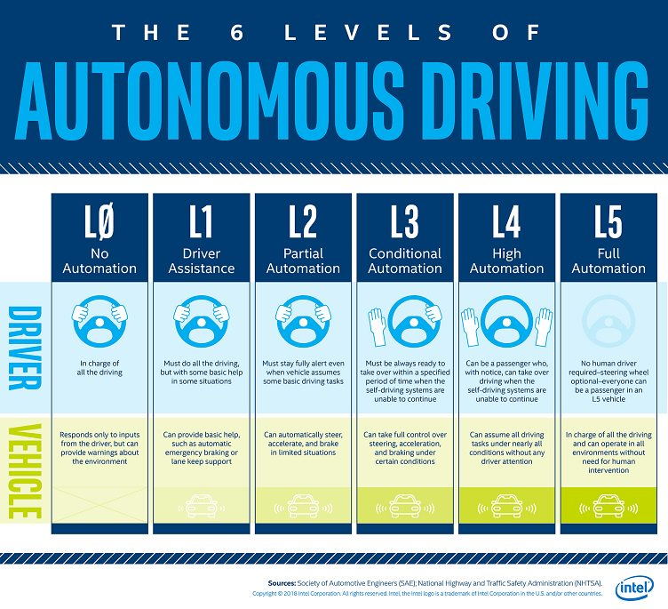

# 自主性等级分类

自动驾驶按照自主性程度可以分成 6 个等级。国际自动机工程师学会 (SAE International) 制定的 J3016 标准是目前最广泛使用的分级体系，将驾驶自动化从 L0 到 L5 划分为六个级别。

> 图片来源: SAE International

## SAE 分级详解

| 级别 | 名称 | 驾驶操作 | 环境监测 | 后备响应 | 适用场景 |
| --- | --- | --- | --- | --- | --- |
| L0 | 无自动化 | 人类 | 人类 | 人类 | — |
| L1 | 驾驶辅助 | 人类+系统 | 人类 | 人类 | 自适应巡航 或 车道保持 |
| L2 | 部分自动化 | 系统 | 人类 | 人类 | 自适应巡航 + 车道保持 |
| L3 | 有条件自动化 | 系统 | 系统 | 人类 | 高速公路拥堵（限速 60 km/h） |
| L4 | 高度自动化 | 系统 | 系统 | 系统 | 限定区域无人驾驶 |
| L5 | 完全自动化 | 系统 | 系统 | 系统 | 任意场景 |

## 关键分界线

### L2 与 L3 的本质区别
L2 和 L3 之间是自动驾驶最重要的分界线。核心区别在于 **环境监测责任的转移**：

- **L2**：驾驶员必须始终监控道路环境，系统只是辅助工具。事故责任由驾驶员承担
- **L3**：系统负责环境监测，驾驶员可以暂时脱离驾驶任务（如看手机），但必须在系统发出接管请求 (Take-Over Request) 后及时接管。系统激活期间的事故责任由制造商承担

这一责任转移带来了巨大的法律和保险影响，也是 L3 量产推进缓慢的主要原因。

### L3 与 L4 的区别
L4 不再依赖人类作为后备，系统在设计运行域 (ODD, Operational Design Domain) 内可完全自主处理所有场景。当超出 ODD 时，车辆会自行安全停靠而非要求人类接管。

## 行业部署现状

| 级别 | 代表产品/公司 | 状态 |
| --- | --- | --- |
| L2 | Tesla Autopilot、小鹏 NGP、蔚来 NOP | 大规模量产 |
| L2+ | 华为 ADS、理想 AD Max | 量产，高速+城区 NOA |
| L3 | 奔驰 DRIVE PILOT、宝马 L3 | 已在欧洲获批，限定场景 |
| L4 | Waymo、百度 Apollo、小马智行 | Robotaxi 限定区域运营 |
| L5 | — | 尚无量产产品 |

当前行业趋势是通过 L2+ 渐进式路线积累数据和经验，同时在限定区域推进 L4 级 Robotaxi 商业化运营。

## 参考资料

1. SAE International. J3016: Taxonomy and Definitions for Terms Related to Driving Automation Systems for On-Road Motor Vehicles.
2. NHTSA. Automated Vehicles for Safety.
